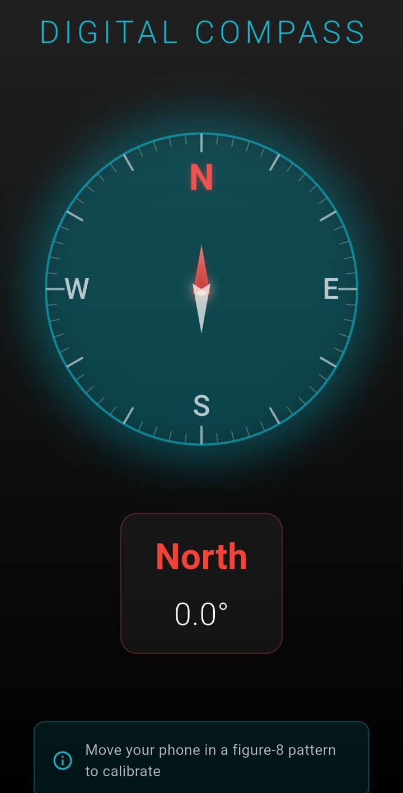

# 🧭 Digital Compass App

A modern, real-time compass application built with Flutter that utilizes device magnetometer sensors for accurate directional tracking.


## 📱 Demo

<!-- Add your demo GIF or screenshot here -->
<p align="center">
  
</p>

> **Note:** Demo requires a device with magnetometer sensor. Screenshot shown for UI preview.

## 📸 Screenshots

<table>
  <tr>
    <td align="center"><br><b>North Direction</b></td>

  </tr>
</table>

## ✨ Features

- **Real-time Direction Tracking** - Live compass updates using magnetometer sensor
- **360° Smooth Rotation** - Fluid animations with precise degree measurements
- **Modern UI Design** - Dark theme with gradient effects and glowing elements
- **Cardinal Direction Labels** - Clear N, S, E, W markers with custom styling
- **Degree Display** - Shows exact heading from 0° to 360°
- **Calibration Guide** - Built-in instructions for optimal accuracy
- **Custom Needle Design** - Red north pointer with shadow effects
- **Compass Rose Animation** - Rotating tick marks for enhanced visualization

## 🛠️ Built With

- **Flutter** - Cross-platform mobile framework
- **Dart** - Programming language
- **flutter_compass** - Magnetometer sensor package
- **CustomPainter** - Custom UI graphics rendering

## 📱 Requirements

- Physical device with **magnetometer sensor**
- Android 5.0+ or iOS 10.0+
- Flutter 3.0+

> **Note:** This app requires a physical device to function. Emulators and some budget phones (like Redmi 9C) do not have magnetometer sensors.

## 🚀 Installation

```bash
# Clone the repository
git clone https://github.com/YOUR_USERNAME/flutter-compass-app.git

# Navigate to project directory
cd flutter-compass-app

# Install dependencies
flutter pub get

# Run on connected device
flutter run --release
```

## 📦 Build APK

```bash
flutter build apk --release
```

APK location: `build/app/outputs/flutter-apk/app-release.apk`

## 🎯 How It Works

The app streams data from the device's magnetometer sensor via the `flutter_compass` package. It calculates the heading angle (0-360°) and rotates the compass rose inversely to keep the north marker aligned with magnetic north, while the red needle remains fixed pointing upward.

## 🧪 Calibration

For best accuracy, calibrate your device compass by:
1. Moving your phone in a figure-8 pattern
2. Avoiding magnetic interference (speakers, magnets, metal objects)
3. Using the app in open areas

## 📂 Project Structure

```
lib/
├── main.dart                    # App entry point
└── compass_screen.dart          # Main compass UI and logic
```

## 🎨 Design Highlights

- Gradient background (grey to black)
- Glowing cyan effects on compass ring
- Custom painted tick marks (major every 30°, minor every 6°)
- Red-to-white gradient needle
- Smooth rotation animations
- Material Design principles

## 🤝 Contributing

Contributions, issues, and feature requests are welcome! Feel free to check the [issues page](https://github.com/YOUR_USERNAME/flutter-compass-app/issues).

## 📄 License

This project is licensed under the MIT License - see the [LICENSE](LICENSE) file for details.

## 👨‍💻 Author

**Your Name**
- GitHub: [@AeonForts](https://github.com/AeonForts)

## 🌟 Acknowledgments

- Flutter team for the amazing framework
- flutter_compass package maintainers
- Material Design for UI inspiration

---

⭐ **Star this repo** if you found it helpful!